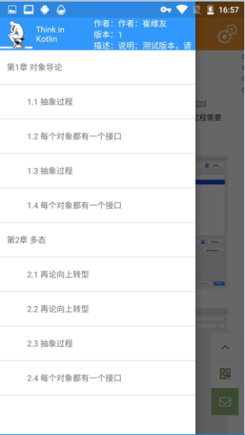

SharePoint是什么?
====
创建一个中心点，将不同的线连接起来，每条线的末端都是一个分享体、使用体。
初始是做个有“Think in Kotlin”的应用，能够让每个人分享自己的经验，学习别人的经验。随着设计成型，发现这个应用可不仅限于Kotlin的学习。只要是你希望呈现的内容，都可以通过这个中心点展示给别人。


如何使用
====
1.创建自己的目录
------- 
按照固定的json格式整理自己的课程网址
 ``` json
{
	"title": "Think in Kotlin",
	"logo": "http://www.gaohaiyan.com/sharepoint/thinkinkotlin_90.png",
    "aoer": "作者：崔维友",
    "desc": "说明：测试版本，请使用其他网友的目录。这个可显示在目录上。v：版本，一个数值",
    "v": "1",
    "menu": [
        {
			"desc":"章节说明。cpt是章节编号，t是标题，v是版本号，cs是课程集合。这个menu是一个二级集合",
            "cpt": "1",
            "t": "第1章 对象导论",
            "v": "1",
            "cs": [
                {
                    "v": "1",
                    "c": "1",
                    "t": "1.1 抽象过程",
                    "u": "http://www.runoob.com/kotlin/kotlin-setup.html",
					"desc":"v课程的版本，c课程的编号，t课程名称，u课程的网址"
                },
                {
                    "v": "1",
                    "c": "2",
                    "t": "1.2 每个对象都有一个接口",
                    "u": "http://www.runoob.com/kotlin/kotlin-eclipse-setup.html",
					"desc":""
                },
                {
                    "v": "1",
                    "c": "3",
                    "t": "1.3 抽象过程",
                    "u": "http://www.runoob.com/kotlin/kotlin-setup.html",
					"desc":""
                },
                {
                    "v": "1",
                    "c": "4",
                    "t": "1.4 每个对象都有一个接口",
                    "u": "http://www.runoob.com/kotlin/kotlin-eclipse-setup.html",
					"desc":""
                }
            ]
        },
        {
			"desc":"本参数仅用于肉眼阅读",
            "cpt": "2",
            "t": "第2章 多态",
            "v": "1",
            "cs": [
                {
                    "v": "1",
                    "c": "1",
                    "t": "2.1 再论向上转型",
                    "u": "http://www.runoob.com/kotlin/kotlin-command-line.html",
					"desc":"v课程的版本，c课程的编号，t课程名称，u课程的网址"
                },
                {
                    "v": "1",
                    "c": "2",
                    "t": "2.2 再论向上转型",
                    "u": "http://www.runoob.com/kotlin/otlin-android-setup.html",
					"desc":"desc仅用于肉眼阅读"
                },
                {
                    "v": "1",
                    "c": "3",
                    "t": "2.3 抽象过程",
                    "u": "http://www.runoob.com/kotlin/kotlin-setup.html",
					"desc":""
                },
                {
                    "v": "1",
                    "c": "4",
                    "t": "2.4 每个对象都有一个接口",
                    "u": "http://www.runoob.com/kotlin/kotlin-eclipse-setup.html",
					"desc":""
                }
            ]
        }
    ]
}
 ```

2.将这个目录数据保存为json文件
------- 
将文件放到一个长期可用的服务器上，得到它的网址，如 h t t p : // www. mywebsite. com / mymenu. json 。

3.在应用中配置自己的目录json
------- 


图例
====



有问题反馈
====
在使用中有任何问题，欢迎反馈给我，可以用以下联系方式跟我交流

* 作者：Vigiles
* QQ：731942771
* Emial：vigiles@163.com
* [站点](http://www.gaohaiyan.com)
* [gh](https://github.com/731942771/SharePoint)

尝试
====
[SharePoint_v1](SharePoint_v1.apk)

支持开发者
====
做这个也有5年了，推荐个安卓开发岗位吧 ;) 。


感激
====
感谢Github对我的默默支持，感谢牛顿让我知道了重力，感谢Walter White牛逼的化学功底。
感谢各位！
